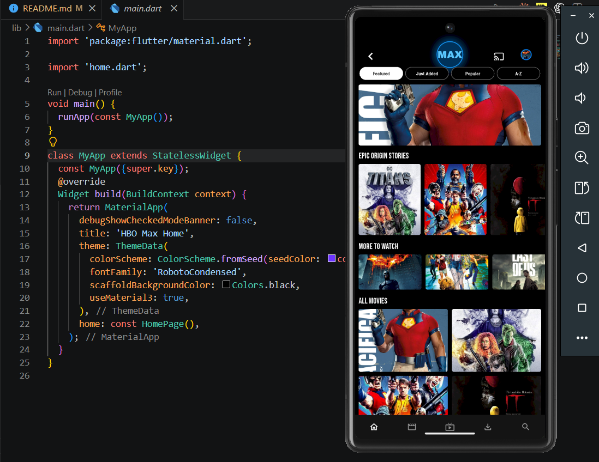
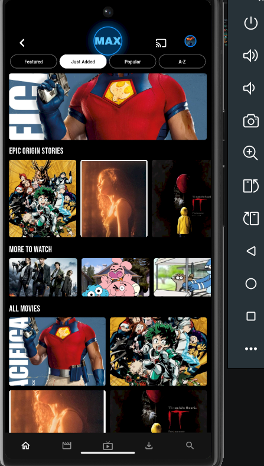
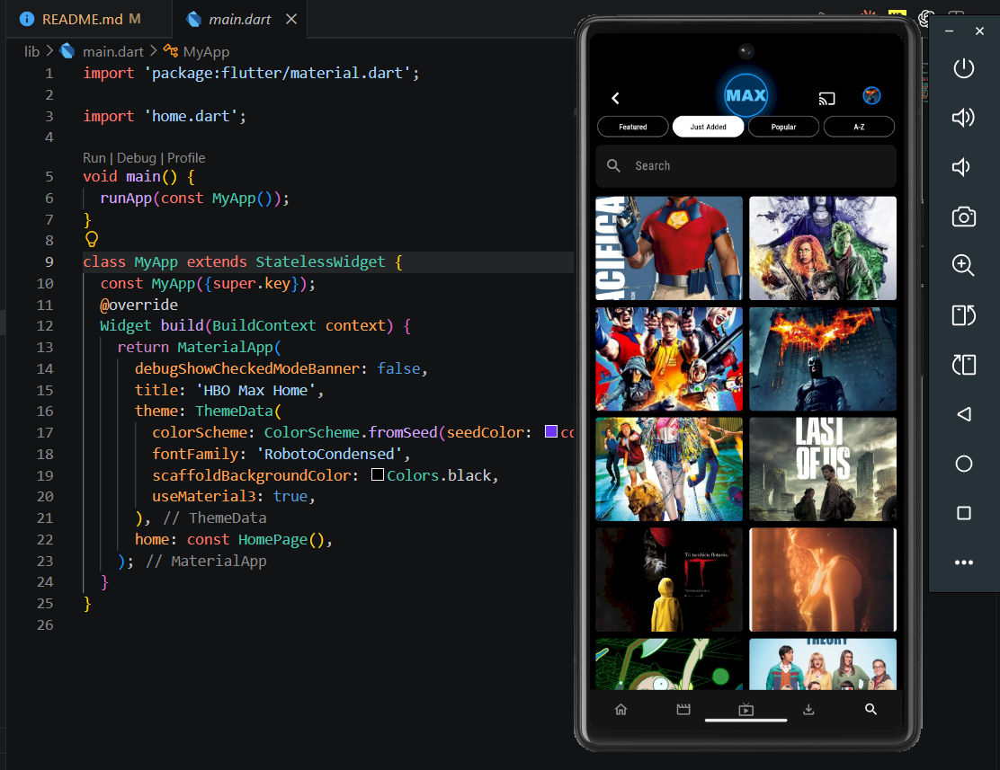
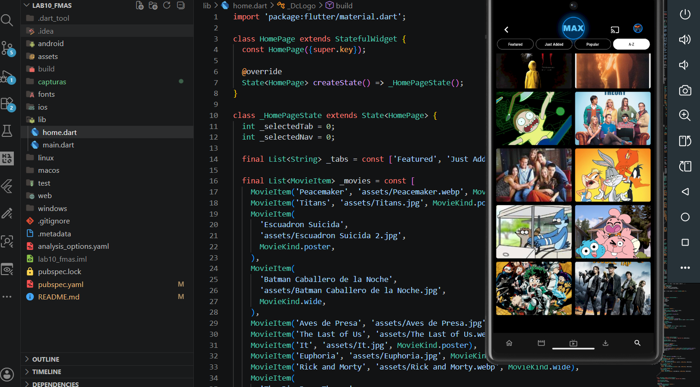

# Laboratorio 10 - Flutter HBO Max Home

Este laboratorio desarrolla una pantalla Home inspirada en la aplicacion movil de HBO Max usando Flutter. La interfaz muestra contenido multimedia mediante imagenes locales, secciones tipo catalogo, navegacion inferior, categorias interactivas y un tema visual oscuro.

## Elemento de la capacidad

Comprender a utilizar y crear:

- ListViews
- ListTiles
- Listas y Mapas
- Rutas
- Tema Global
- Cards

## Trabajo realizado

- Creacion de la pantalla principal `Home` en Flutter.
- Uso de `ListView` para mostrar secciones desplazables.
- Uso de listas de datos para organizar peliculas y series.
- Implementacion de navegacion inferior interactiva.
- Configuracion de tema global desde `main.dart`.
- Uso de imagenes locales desde la carpeta `assets/`.
- Configuracion de fuentes personalizadas desde la carpeta `fonts/`.

## Fuentes utilizadas

Se agregaron tres tipos de letra al proyecto:

- `ArchivoBlack`
- `BebasNeue`
- `RobotoCondensed`

Estas fuentes fueron declaradas en `pubspec.yaml` y aplicadas dentro de la interfaz.

## Capturas

## Autor

Fernando Mas Pinto

Alumno del 5to Ciclo de la carrera Diseño y Desarrollo de Software.
